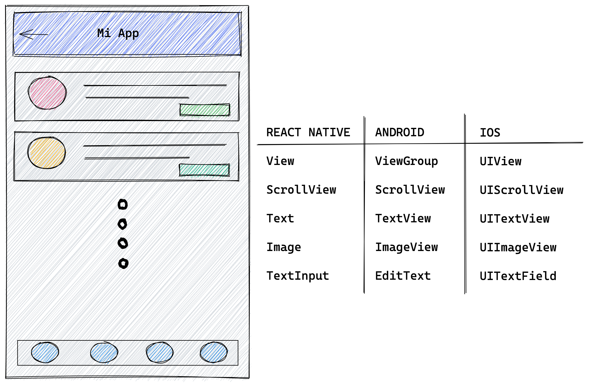
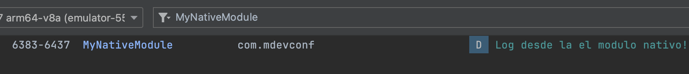

> This article is based on the talk I gave at [MDevConf](https://twitter.com/mdevconfbo) on December 3, 2022. You can find the slides for this talk [here](https://slides.com/veronicaclavijoaltamirano/minimal).

As you may already know, React Native is a React-based framework for creating native applications for iOS and Android using Javascript. React Native has the ability to transpile Javascript code into native code for each platform (Swift or Objective C for iOS devices, Kotlin or Java for Android devices), but also in case you need to write native code, React Native exposes the `NativeModule` API to facilitate this work.

The way React Native "transforms" Javascript / React code into native code is by using the so-called _Bridge_, which is basically a connection between the Javascript code and the native code.


This is what allows React Native components to be converted into native components. For example, a `View` component in React Native is transformed into `ViewGroup` in Android and `UIView` in iOS.



## How to create the first Android Native Module?

> You can follow [this](https://github.com/veronicaclavijo/react-native-android-native-module) explanation in this repository by navigating the different branches and see the progress.

To start you need to create a java file inside `android/app/src/main/java/com/{APP_NAME}/MyNativeModule.java` with this initial content:

```java
// MyNativeModule.java
package com.mdevconf;

import android.util.Log;
import androidx.annotation.NonNull; 
import com.facebook.react.bridge.ReactApplicationContext;
import com.facebook.react.bridge.ReactContextBaseJavaModule;
import com.facebook.react.bridge.ReactMethod;

public class MyNativeModule extends ReactContextBaseJavaModule {
  MyNativeModule(ReactApplicationContext context) {
    super(context);
  }

  @NonNull
  @Override
  public String getName() {
    return "MyNativeModule";
  }
}
```

An important detail of the previous code is that the new Java class has to extend `ReactContextBaseJavaModule`, which is the base for building the Native Module. Also, note the `getName` method that gives the name to the Native Module so that it can be accessed from Javascript with that same name, for example, you can access this in a React Native component through:

```js
const {MyNativeModule} = ReactNative.NativeModules;
```

### 2. Export a native method to Javascript ([branch](https://github.com/veronicaclavijo/react-native-android-native-module/tree/branch-2))

You need to create a method that can eventually be used from Javascript, in this case, it will be a simple Logger that allows us to show a message in Logcat.

This method is annotated with the `@ReactMethod` decorator to indicate that it will be used within the Javascript code.

```java
// MyNativeModule.java
public class MyNativeModule extends ReactContextBaseJavaModule {
  ...
  @ReactMethod
  public void simpleLogger() {
    Log.d("MyNativeModule", "Log desde la el modulo nativo!");
  }
}
```

### 3. Register the Native Module ([branch](https://github.com/Veuge/MDevConf/tree/3.register-in-package))

The next step is to register this module in a package, to achieve this you need to create a new Java file inside `android/app/src/main/java/com/{APP_NAME}/MyPackage.java` with the following content:

```java
// MyNativePackage.java
package com.mdevconf;

import androidx.annotation.NonNull;
import com.facebook.react.ReactPackage;
import com.facebook.react.bridge.NativeModule;
import com.facebook.react.bridge.ReactApplicationContext;
import com.facebook.react.uimanager.ViewManager;

import java.util.ArrayList;
import java.util.Collections;
import java.util.List;

public class MyNativePackage implements ReactPackage {
  @NonNull
  @Override
  public List<ViewManager> createViewManagers(@NonNull ReactApplicationContext reactContext) {
    return Collections.emptyList();
  }

  @NonNull
  @Override
  public List<NativeModule> createNativeModules(@NonNull ReactApplicationContext reactContext) {
    List<NativeModule> modules = new ArrayList<>();
    modules.add(new MyNativeModule(reactContext));
    return modules;
  }
}
```

With this file, what you do is register the Native Module within a package so that it can be used in `MainApplication.java`

### 4. Register the package ([branch](https://github.com/Veuge/MDevConf/tree/4.register-in-mainapplication))

To achieve this, you need to modify the `MainApplication.java` file as follows:

```java
// MainApplication.java
public class MainApplication extends Application implements ReactApplication {
  private final ReactNativeHost mReactNativeHost =
    new ReactNativeHost(this) {
      .......
      @Override
      protected List<ReactPackage> getPackages() {
        @SuppressWarnings("UnnecessaryLocalVariable")
        List<ReactPackage> packages = new PackageList(this).getPackages();
        // Packages that cannot be autolinked yet can be added manually here, for example:
        // packages.add(new MyReactNativePackage());
        packages.add(new MyNativePackage());
        return packages;
      }
      .......
    };
  .....
}
```

With these changes, the Native Module is ready to be used from Javascript. At this point, it is important to run the application from scratch with the command:

```sh
npx react-native run-android
```

### 5. Import and use in React Native! ([branch](https://github.com/Veuge/MDevConf/tree/5.import-and-use-in-rn))

At this point you can import the Native Module in your React Native components and use it as follows:

```javascript
// App.js

import {
  ...
  NativeModules,
  ...
} from 'react-native';

const {MyNativeModule} = NativeModules;

const App = () => {
  const onPressButton = () => {
    console.log('Este es un log desde javascript');
    MyNativeModule.simpleLogger();
  };

  return (
    <SafeAreaView>
      <StatusBar barStyle={'light-content'} />
      <View style={styles.container}>
        <Text style={styles.text}>Hello MDevConf!</Text>
        <Button title="Click me" onPress={onPressButton} />
      </View>
    </SafeAreaView>
  );
};
```

This is a very simple example, what you need to do is import the `NativeModules` from `react-native`, destructure our native module, and in this example we named it `MyNativeModule`, once we have access to the native module we can invoke the method we exported to register a log in the device LogCat when we click the button.

```
MyNativeModule.simpleLogger();
```


Once the app is running in an emulator and the user clicks the button, you should see the following log in LogCat:



## Links
- [Documentacion oficial RN Native Modules](https://reactnative.dev/docs/native-modules-android)
- [Presentación charla en MDevConf](https://slides.com/veronicaclavijoaltamirano/minimal)
- [Repositorio de ejemplo](https://github.com/Veuge/MDevConf)