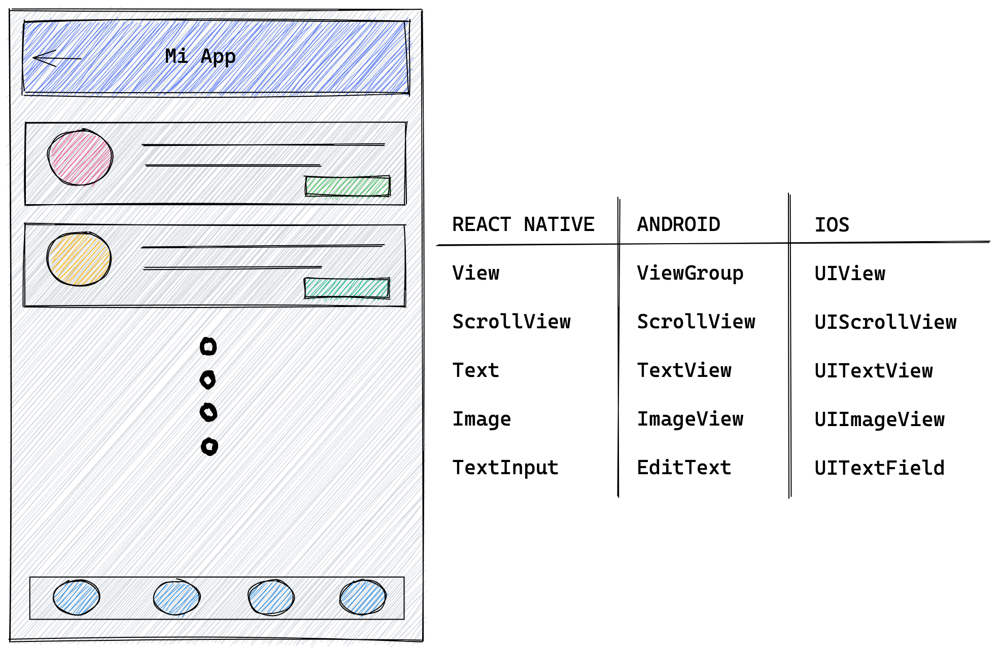
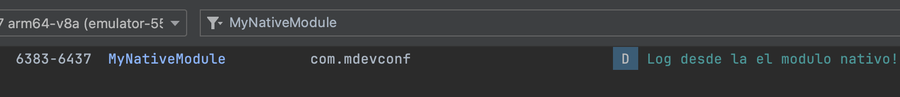

> Este artículo está escrito en base a la charla que dí en el [MDevConf](https://twitter.com/mdevconfbo) el 3 de Diciembre de 2022. Puedes encontrar las diapositivas de esta charla [aquí](https://slides.com/veronicaclavijoaltamirano/minimal).

Como ya debes saber React Native es un framework basado en React para crear aplicaciones nativas para iOS y Android utilizando Javascript, React Native tiene la capacidad de transpilar el codigo Javascript en código nativo de cada plataforma (Swift o Objective C para dispositivos iOS, Kotlin o Java para dispositivos Android), pero además en caso de necesitar escribir código nativo React Native expone la API `NativeModule` para facilitar este trabajo.

La manera como React Native "transforma" el código Javascript / React a código nativo es usando el denominado _Bridge_ que básicamente es una conexión entre el código Javascript y el código nativo. 


Esto es lo que hace que los componentes de React Native sea convertido a componentes de las plataformas nativas. Por ejemplo un componente `View` de React Native es transformado a `ViewGroup` de Android y `UIView` de iOS.



## ¿Cómo crear el primer Modulo Nativo de Android?

> Puedes seguir esta explicación en [este](https://github.com/Veuge/MDevConf) repositorio navegando los branches para ver el progreso.

### 1. Crear un archivo de Módulo Nativo ([branch](https://github.com/Veuge/MDevConf/blob/1.native-module-file))

Inicialmente necesitas crear un archivo java dentro de `android/app/src/main/java/com/{NOMBRE_DE_LA_APP}/MyNativeModule.java` con este contenido inicial:

```java
// MyNativeModule.java
package com.mdevconf;

import android.util.Log;
import androidx.annotation.NonNull; 
import com.facebook.react.bridge.ReactApplicationContext;
import com.facebook.react.bridge.ReactContextBaseJavaModule;
import com.facebook.react.bridge.ReactMethod;

public class MyNativeModule extends ReactContextBaseJavaModule {
  MyNativeModule(ReactApplicationContext context) {
    super(context);
  }

  @NonNull
  @Override
  public String getName() {
    return "MyNativeModule";
  }
}
```

Un detalle importante del código anterior en que la nueva clase Java tiene que extender de `ReactContextBaseJavaModule` que es base para construir el Módulo Nativo. También hay que notar el método `getName` que da el nombre al Módulo Nativo para que pueda ser accedido desde Javascript con ese mismo nombre, por ejemplo se podrá acceder a este en un componente React Native mediante:

```js
const {MyNativeModule} = ReactNative.NativeModules;
```

### 2. Exportar un método nativo Javascript ([branch](https://github.com/Veuge/MDevConf/tree/2.export-method))
Se debe crear un metodo que eventualmente podrá ser usado desde Javascript, en este caso será un Logger simple que nos permita mostrar un mensaje el Logcat.

Este método esta anotado con el decorador `@ReactMethod` para indicar que será utilizado dentro del código Javascript.

```java
// MyNativeModule.java
public class MyNativeModule extends ReactContextBaseJavaModule {
  ...
  @ReactMethod
  public void simpleLogger() {
    Log.d("MyNativeModule", "Log desde la el modulo nativo!");
  }
}
```

### 3. Registrar el módulo dentro de un package ([branch](https://github.com/Veuge/MDevConf/tree/3.register-in-package))

El siguiente paso es registrar este modulo dentro de un package, para lo que se crea un nuevo archivo Java dentro de `android/app/src/main/java/com/{NOMBRE_DE_LA_APP}/MyNativePackage.java` con el siguiente contenido:

```java
// MyNativePackage.java
package com.mdevconf;

import androidx.annotation.NonNull;
import com.facebook.react.ReactPackage;
import com.facebook.react.bridge.NativeModule;
import com.facebook.react.bridge.ReactApplicationContext;
import com.facebook.react.uimanager.ViewManager;

import java.util.ArrayList;
import java.util.Collections;
import java.util.List;

public class MyNativePackage implements ReactPackage {
  @NonNull
  @Override
  public List<ViewManager> createViewManagers(@NonNull ReactApplicationContext reactContext) {
    return Collections.emptyList();
  }

  @NonNull
  @Override
  public List<NativeModule> createNativeModules(@NonNull ReactApplicationContext reactContext) {
    List<NativeModule> modules = new ArrayList<>();
    modules.add(new MyNativeModule(reactContext));
    return modules;
  }
}
```

Con este archivo lo que se hace es registrar el Modulo Nativo dentro de un package para que pueda ser usado utilizado en `MainApplication.java`

### 4. Registrar el package ([branch](https://github.com/Veuge/MDevConf/tree/4.register-in-mainapplication))

Para esto se debe modificar el archivo `MainApplication.java` como sigue:

```java
// MainApplication.java
public class MainApplication extends Application implements ReactApplication {
  private final ReactNativeHost mReactNativeHost =
    new ReactNativeHost(this) {
      .......
      @Override
      protected List<ReactPackage> getPackages() {
        @SuppressWarnings("UnnecessaryLocalVariable")
        List<ReactPackage> packages = new PackageList(this).getPackages();
        // Packages that cannot be autolinked yet can be added manually here, for example:
        // packages.add(new MyReactNativePackage());
        packages.add(new MyNativePackage());
        return packages;
      }
      .......
    };
  .....
}
```

Con estos cambios el Modulo Nativo esta listo para ser usado desde Javascript, en este punto es importante hacer correr la aplicacion desde cero con el comando

```sh
npx react-native run-android
```

### 5. Import y utilizar en React Native! ([branch](https://github.com/Veuge/MDevConf/tree/5.import-and-use-in-rn))

En este punto ya podemos utilizar nuestro módulo nativo desde la aplicación en Javascript, para esto se debe modificar el archivo `App.js`:

```javascript
// App.js

import {
  ...
  NativeModules,
  ...
} from 'react-native';

const {MyNativeModule} = NativeModules;

const App = () => {
  const onPressButton = () => {
    console.log('Este es un log desde javascript');
    MyNativeModule.simpleLogger();
  };

  return (
    <SafeAreaView>
      <StatusBar barStyle={'light-content'} />
      <View style={styles.container}>
        <Text style={styles.text}>Hello MDevConf!</Text>
        <Button title="Click me" onPress={onPressButton} />
      </View>
    </SafeAreaView>
  );
};
```

Este es un ejemplo muy simple, lo que se hace es importar `NativeModules` del paquete `react-native`, destructurar el nombre de nuestro modulo nativo, en este caso lo llamamos `MyNativeModule`, una vez tenemos acceso al modulo nativo podemos invocar el metodo que exportamos para registrar un log en el logcat del dispositivo al activar un boton:

```
MyNativeModule.simpleLogger();
```


Una vez que la aplicación este corriendo en el emulador y el usuario haga click en el boton se podrá ver el mensaje en la ventana de Logcat, como en la imagen:



## Links
- [Documentacion oficial RN Native Modules](https://reactnative.dev/docs/native-modules-android)
- [Presentación charla en MDevConf](https://slides.com/veronicaclavijoaltamirano/minimal)
- [Repositorio de ejemplo](https://github.com/Veuge/MDevConf)

