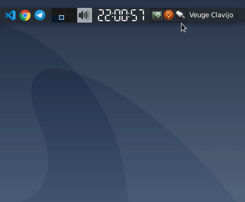
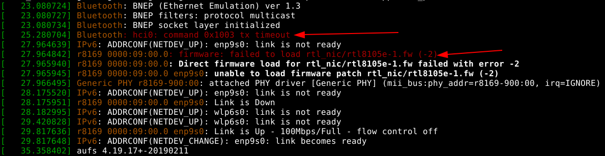

I just installed the [latest version](https://wiki.debian.org/DebianBuster) of Debian on my personal computer. So far everything is going well, but as expected, there are some extra configurations needed to get WiFi working. Here are the steps I followed:

The first thing is to know exactly the model of the WiFi device controller, using the following command you can get that information:

```bash
$ lspci | grep -i network
```

The output of this command is something like this:

```bash
06:00.0 Network controller: Broadcom Limited BCM43142 802.11b/g/n (rev 01)
```

Therefore, the model of the controller is `BCM43142`, following [these instructions](https://wiki.debian.org/wl) specific for certain controllers. Following those steps should be all set to connect to a WiFi network, but for some reason, this was happening:



It seemed that the NetworkManager GUI was trying to connect to the WiFi network but was failing and aborting the process. What was going on?

To find out, the first option is to check with dmesg

```bash
$ sudo dmesg
```

The output turned out like this:


I didn't have the firmware installed xD. Just modify the sources.list by adding the non-free packages:

```bash
# /etc/apt/sources.list
deb http://ftp.de.debian.org/debian buster main non-free
deb-src  http://ftp.de.debian.org/debian buster main non-free
```

And install the firmware:

```bash
$ sudo apt update
$ sudo apt install firmware-realtek
```

And that's it!
