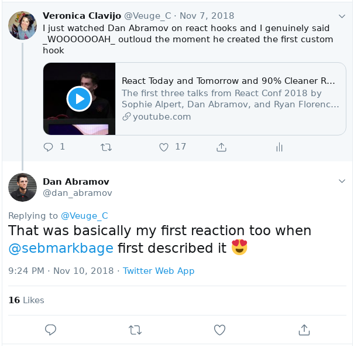

El sector de tecnología es muy cambiante y evoluciona rápidamente, es importante mantenerse al tanto de todas las novedades.

Trato de hacerlo lo mas que puedo aunque hay tantos recursos y tantos temas que a veces es dificil mantener el paso. De todas formas estas son las fuentes con las que me informo:

1. [Hacker news](https://news.ycombinator.com/) de YCombinator: esta es definitivamente la principal fuente de noticias e información que sigo. Los feeds de este sitio en general contienen noticias tecnológicas, noticias curiosas, entre otras. Generalmente hay un par que son de mi interés.
2. Twitter! si sigues a las personas correctas tu página inicial de twitter va a estar llena de recursos. Yo sigo a personas y páginas que en general aportan mucho en los temas que me interesan, por ejemplo:

   - [Julia Evans](https://twitter.com/b0rk) tiene una manera genial de explicar las cosas con comics, que van desde medio a bajo nivel de Linux y ademas consejos de como debuggear, como ser mejor developer y más.
   - [Dan Abramov](https://twitter.com/dan_abramov) es uno de los desarrolladores de ReactJS y aporta al desarrollo de los DevTools de ReactNative. Es increíble como logra hacer tantas cosas a la vez, está pendiente de tweets respecto a ReactJS y responde muchas dudas que las personas tienen. Una vez respondió a mi tweet!!! (ve la imagen al terminar este post).
   - [Sheila Berta](https://twitter.com/UnaPibaGeek) esta chica argentina es especialista en seguridad informática, ha dado charlas en un montón de eventos incluyendo DEFCON y actualmente dicta un curso de Infosec en Buenos Aires.
   - [Chris Fidao](https://twitter.com/fideloper) aprendí muchas cosas de Linux con su libro [Servers for Hackers](https://serversforhackers.com) y cosas de Docker, tambien twittea respecto a Laravel.
   - [Marcy Sutton](https://twitter.com/marcysutton) es una genia en a11y y twittea muy buenos recursos para hacer de la web un lugar mas accesible para todos.
   - [Sara Soueidan](https://twitter.com/SaraSoueidan) es frontend developer, especialista en CSS, SVG y Javascript, su blog está lleno de artículos interesantes.
   - [JavaScript Daily](https://twitter.com/JavaScriptDaily) publica siempre los nuevos paquetes de NPM que son tendencia en descargar, nuevos frameworks y en general recursos de Javascript de todo Internet.

3. [FayerWayer](https://www.fayerwayer.com/) es una plataforma en español con noticias tecnológicas muy variadas.

Ese es un resumen de mis fuentes de información y noticias. Si tienes alguna más no dudes en escribirme!.

Como lo prometí este es mi tweet al que Dan Abramov respondió. Es como un trofeo para mi xD.

Saludos!

