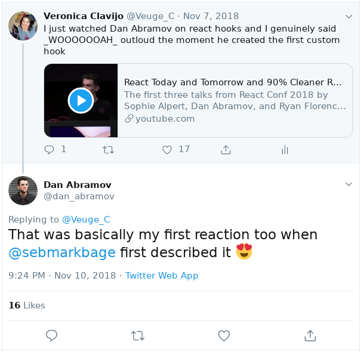

The technology sector is very changing and evolves rapidly, it is important to keep up with all the news.

I try to do it as much as I can although there are so many resources and so many topics that sometimes it is difficult to keep up. Anyway, these are the sources with which I inform myself:

1. [Hacker news](https://news.ycombinator.com/) from YCombinator: this is definitely the main source of news and information that I follow. The feeds of this site in general contain technological news, curious news, among others. Generally there are a couple that are of my interest.
2. Twitter! if you follow the right people your twitter homepage will be full of resources. I follow people and pages that in general contribute a lot in the topics that interest me, for example:

    - [Julia Evans](https://twitter.com/b0rk) has a great way of explaining things with comics, which range from medium to low level of Linux and also advice on how to debug, how to be a better developer and more.
    - [Dan Abramov](https://twitter.com/dan_abramov) is one of the developers of ReactJS and contributes to the development of ReactNative DevTools. It is incredible how he manages to do so many things at the same time, he is aware of tweets regarding ReactJS and responds to many doubts that people have. Once he responded to my tweet!!! (see the image at the end of this post).
    - [Sheila Berta](https://twitter.com/UnaPibaGeek) this girl from Argentina is a specialist in computer security, has given talks at a lot of events including DEFCON and currently teaches an Infosec course in Buenos Aires.
    - [Chris Fidao](https://twitter.com/fideloper) I learned many things about Linux with his book [Servers for Hackers](https://serversforhackers.com) and things about Docker, he also tweets regarding Laravel.
    - [Marcy Sutton](https://twitter.com/marcysutton) is a genius in a11y and tweets very good resources to make the web a more accessible place for everyone.
    - [Sara Soueidan](https://twitter.com/SaraSoueidan) is a frontend developer, specialist in CSS, SVG and Javascript, her blog is full of interesting articles.
    - [JavaScript Daily](https://twitter.com/JavaScriptDaily) always publishes the new NPM packages that are trending in download, new frameworks and in general Javascript resources from all over the Internet.

3. [FayerWayer](https://www.fayerwayer.com/) is a platform in Spanish with very varied technological news.

This is a summary of my sources of information and news. If you have any more do not hesitate to write to me!.

As I promised this is my tweet to which Dan Abramov responded. It is like a trophy for me xD.

Greetings!

