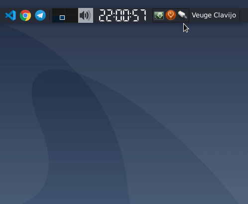
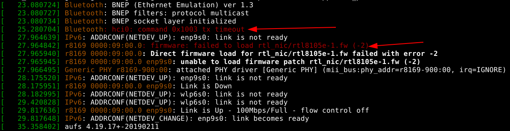

Acabo de instalar en mi compu personal la [ultima versión](https://wiki.debian.org/DebianBuster) de Debian. Hasta ahora todo va bien, pero como es esperado hay que hacer unas configuraciones extras para lograr que funcione el WiFi. Estos son los pasos que seguí:
Lo primero es saber exactamente el modelo del controlador del dispositivo de WiFi, mediante el siguiente comando se obtiene esa información:
```bash
$ lspci | grep -i network
```
El output de este comando es algo asi:
```bash
06:00.0 Network controller: Broadcom Limited BCM43142 802.11b/g/n (rev 01)
```
Por lo tanto el modelo del controlador es `BCM43142`, siguiendo [estas instrucciones](https://wiki.debian.org/wl) específicas para ciertos controladores. Siguiendo esos pasos debería estar todo listo para conectarse a una red WiFi, pero por alguna razón pasaba esto:



Parecía que el GUI NetworkManager intentaba conectarse a la red WiFi, pero fallaba y abortaba el proceso. ¿Qué estaba pasando?

Para averiguar la primera opción es consultar con dmesg
```bash
$ sudo dmesg
````
La salida resultó asi:


No tenía instalado el firmware xD. Basta con modificar el sources.list añadiendo los paquetes non-free:
```bash
# /etc/apt/sources.list
deb http://ftp.de.debian.org/debian buster main non-free
deb-src  http://ftp.de.debian.org/debian buster main non-free
```
E instalar el firmware:
```bash
$ sudo apt update
$ sudo apt install firmware-realtek
```
Y listo!